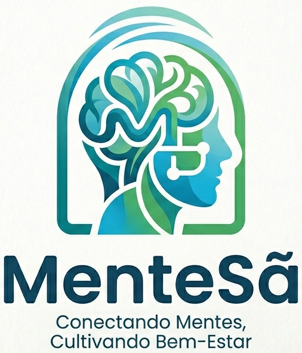

# Sistema para a Clínica MenteSã

Trata-se do Sistema Web (exemplo) para a disciplina de Análise e Projeto Orientado a Objetos, no semestre 2026.1. Especificamente, trata-se de um sistema Web (a ser desenvolvido em Django/Python) visando a automatização das rotinas de uma clínica de psicologia.

# Documentação

Clique em cada um dos links abaixo para acessar o artefato específico.

1. [Descrição Inicial](doc/requisitos/descricao.md)
1. [Documento de Visão](doc/visao/doc-visao.md)
1. [Protótipos de Interface com o Usuário](doc/prototipos/prototipos.md)
1. [Modelo de Casos de Uso](doc/cdu/cdu.md)
1. [Modelo de Domínio](doc/dominio/dominio.md)
1. [Modelo de Dados](doc/bd/bd.md)

> [!TIP]
> As aplicações Django devem ser organizadas em Modelos (*Models*), Visões (*Views*) (com seus Templates) e Serviços (*Services*), conforme orientações detalhadas acessíveis através do seguinte [LINK](doc/projeto/orientacao.md).

# Manual da Desenvolvedor

[Orientações para os desenvolvedores do projeto](doc/guia-ds/guia.md)
