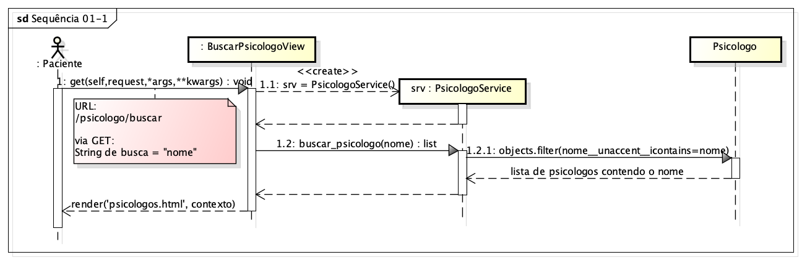
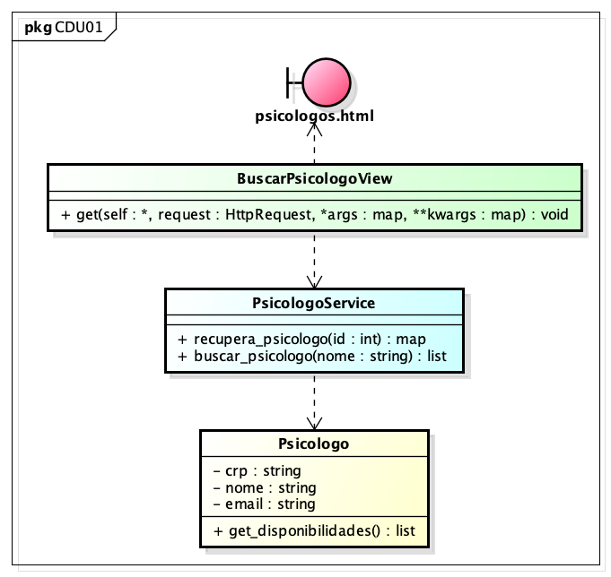

# CDU 01. Pesquisar Psicólogos 

- **Ator principal**: Paciente
- **Atores secundários**: não há	 
- **Resumo**: Um paciente, na página que apresenta a lista dos psicólogos da clínica, preenche o nome (ou uma parte do mesmo) de um psicólogo em um campo de busca e após clicar em "buscar" o sistema busca e apresenta todos os profissionais que contenham o nome ou fragmento informado.
- **Pré-condição**: Paciente devidamente logado
- **Pós-Condição**: nenhuma

## Fluxo Principal
| Ações do ator | Ações do sistema |
| :---: | :---: | 
| 0 - Na página que lista os psicólogos da clínica, o paciente preenche o campo de busca com o nome ou frangmento que deseja buscar e clica no botão correspondente | |  
| | 1 - O sistema busca e apresenta todos os profissionais segundo o critério especificado | 

## Fluxo Alternativo I - Nenhum psicólogo encontrado
| Ações do ator | Ações do sistema |
| :---: |:---: |   
| | 1.1 - O sistema apresenta uma mensagem indicando que nenhum profissional satisfez o critério especificado |

## Fluxo Alternativo II - Campo de busca com menos de três caracteres
| Ações do ator | Ações do sistema |
| :---: | :---: | 
| | 1.2 - O sistema retorna à tela de listagem de todos os psicólogos, apresentando uma mensagem indicando que o campo de busca necessita ter pelo menos três caracteres |  

## Diagrama de Interação (Sequência ou Comunicação)

## Diagrama de Classes de Projeto

