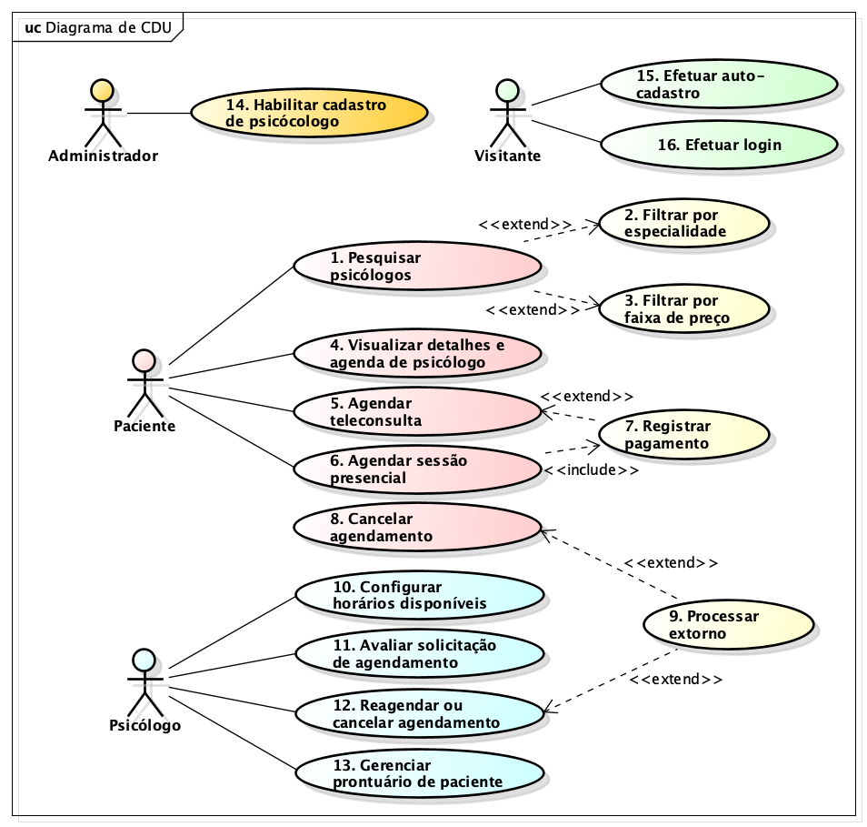

# Modelo de Casos de Uso

## Histórico de Revisões

| Data | Versão | Descrição | Autores |
| :---: | :---: | :---: | :---: |
| 02/06/2026 | 0.1 | Versão inicial | prof. Fellipe |
| 10/06/2026 | 0.2 | Ajuste no detalhamento do CDU 06 | prof. Fellipe |
| 24/06/2026 | 03. | Inclusão do projeto e implementação do CDU 11 | pro. Fellipe |
| - | - | - |  - |

## 1. Diagrama de Casos de Uso

[LINK para o arquivo com o modelo](/doc/arquivo_astah/nome_do_projeto.asta)

## 2. Listagem dos Detalhamentos dos Casos de Uso

1. [CDU-01 - Pesquisar psicólogos](cdu-01/detalhamento-01.md) :white_check_mark:
1. [CDU-05 - Agendar teleconsulta](cdu-05/detalhamento-05.md) 
1. [CDU-06 - Agendar sessão presencial](cdu-06/detalhamento-06.md) :white_check_mark:
1. [CDU-08 - Cancelar agendamento](cdu-08/detalhamento-08.md)
1. [CDU-11 - Avaliar solicitação de agendamento](./cdu-11/detalhamento-11.md)  :white_check_mark:
