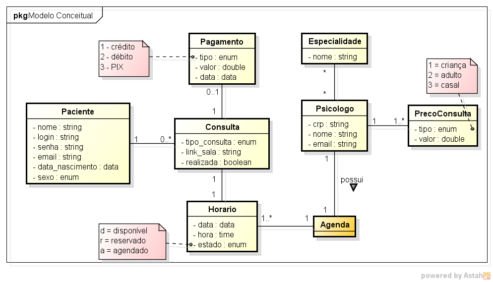

# Modelo de Domínio

## Histórico de Revisões

| Data | Versão | Descrição | Autores |
| :---: | :---: | :---: | :---: |
| 02/06/2026 | 0.1 | Versão inicial | prof. Fellipe |
| - | - | - |  - |

## 1. Diagrama das Classes Conceituais do Domínio

[LINK para o arquivo com o modelo](/doc/arquivo_astah/MenteSa.asta)

## 2. Glossário (sugestão)

| Termo | Explicação |
| :---: | :---: |
| Especialidade | Define a abordagem utilizada pelo profissional ou uma descrição do seu público alvo. |
| PrecoConsulta | Possibilidade do profissional definir preços diferentes para tipos de atendimento diferentes. |
